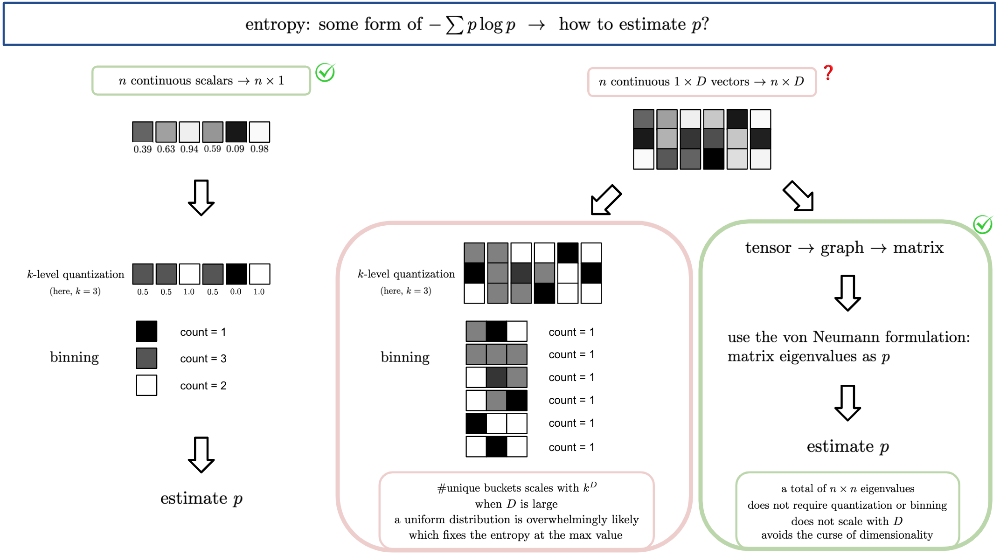
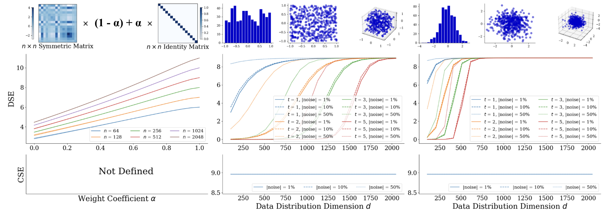
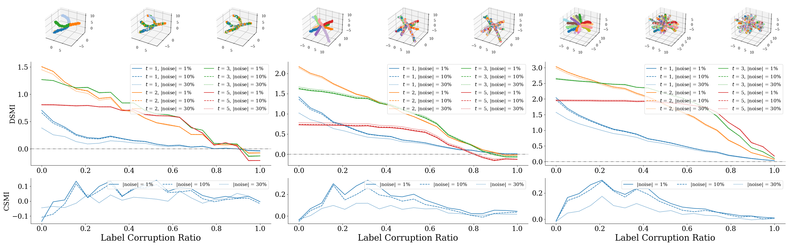
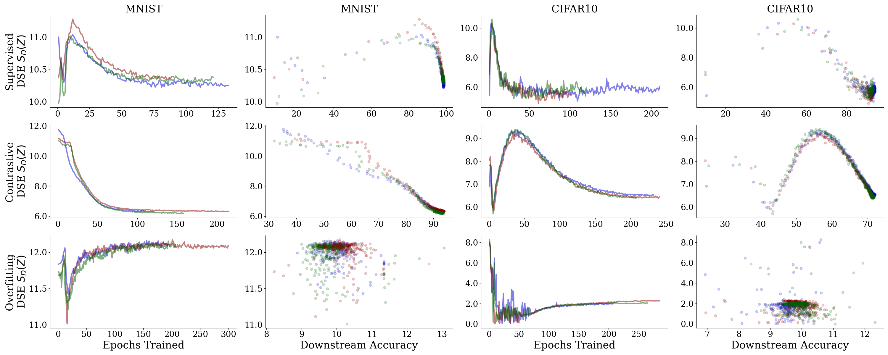
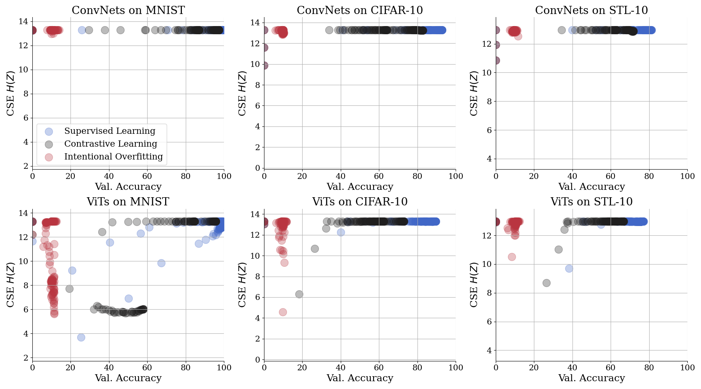
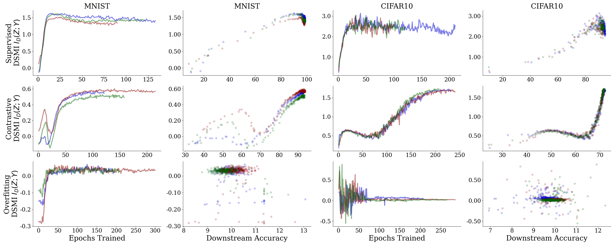
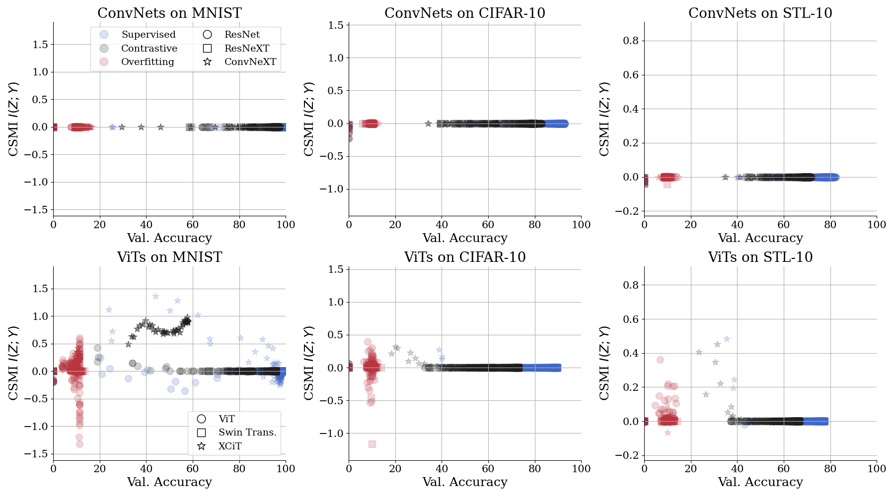

# Diffusion Spectral Entropy
**Krishnaswamy Lab, Yale University**

[](https://twitter.com/KrishnaswamyLab)
[](https://github.com/ChenLiu-1996/DiffusionSpectralEntropy/)


This is the **official** implementation of

**Assessing Neural Network Representations During Training Using Data Diffusion Map Spectra**

 &emsp;  &emsp; 


## News
[Sep 2023] Under review at IEEE ICASSP-OJSP.
[June 2023] A **non-archival** version is accpeted to the [TAG-ML Workshop](https://icml.cc/virtual/2023/workshop/21480) @ **ICML 2023**. [[PDF]](https://openreview.net/pdf?id=DQW3ilre3Q)

## Overview
> We proposed an information-theory based framework to measure the **entropy** and **mutual information** of neural network representations.

We can measure, with respect to a given set of data samples, (1) the entropy of the neural representation at a specific layer and (2) the mutual information between a random variable (e.g., model input or output) and the neural representation at a specific layer.

Compared to the classic Shannon formulation using the binning method, e.g. as in the famous paper **_Deep Learning and the Information Bottleneck Principle_** [[PDF]](https://arxiv.org/abs/1503.02406) [[Github1]](https://github.com/stevenliuyi/information-bottleneck) [[Github2]](https://github.com/artemyk/ibsgd), our proposed method is more robust and expressive.

## Main Advantage
No binning and hence **no curse of dimensionality**. Therefore, **it works on modern deep neural networks** (e.g., ResNet-50), not just on toy models with double digit layer width. See the "Limitations of the Classic Shannon Entropy and Mutual Information" section in our paper for details.



## A One-Minute Explanation of the Methods
Conceptually, we build a data graph from the neural network representations of all data points in a dataset, and compute the diffusion matrix of the data graph. This matrix is a condensed representation of the diffusion geometry of the neural representation manifold. Our proposed **Diffusion Spectral Entropy** and **Diffusion Spectral Mutual Information** can be computed from this diffusion matrix.


## Quick Flavors of the Results

<table border="0">
 <tr>
    <td><b>Diffusion Spectral Entropy</b> (top panel) <br>outperforms <br>Classic Shannon Entropy (bottom panel) <br>on toy data</td>
    <td><b>Diffusion Spectral Mutual Information</b> (top panel) <br>outperforms <br>Classic Shannon Mutual Information (bottom panel) <br>on toy data</td>
 </tr>
 <tr>
    <td></td>
    <td></td>
 </tr>
</table>


<table border="0">
 <tr>
    <td><b>Diffusion Spectral Entropy</b> (top figure) <br>outperforms <br>Classic Shannon Entropy (bottom figure) <br>on real data</td>
    <td><b>Diffusion Spectral Mutual Information</b> (top figure) <br>outperforms <br>Classic Shannon Mutual Information (bottom figure) <br>on real data</td>
 </tr>
 <tr>
    <td><br></td>
    <td><br></td>
 </tr>
</table>

## Repository Hierarchy
```
DiffusionSpectralEntropy
    ├── api: probably the only things you would ever use from this project
    |   |
    |   ├── dse.py: Diffusion Spectral Entropy
    |   └── dsmi.py: Diffusion Spectral Mutual Information
    |
    ├── assets: figures, demos, etc.
    ├── data
    └── src
        ├── embedding_preparation: (dev stage) train models and store the embedding vectors
        ├── manifold_investigation: (dev stage) Our core investigations can be found here
        ├── nn
        ├── utils
        └── main_studies: (Our main studies)
            ├── training_dynamic: (intra-model) evaluating DSE/DSMI along neural network training
            └── vs_acc: (inter-model) correlation analysis between DSE/DSMI and ImageNet accuracy
```


## Citation
```
@inproceedings{DiffusionSpectralEntropy,
  title={Assessing Neural Network Representations During Training Using Data Diffusion Spectra},
  author={Liao, Danqi and Liu, Chen and Tong, Alexander and Huguet, Guillaume and Wolf, Guy and Nickel, Maximilian and Adelstein, Ian and Krishnaswamy, Smita},
  booktitle={ICML 2023 Workshop on Topology, Algebra and Geometry in Machine Learning (TAG-ML)},
  year={2023},
}
```

## API: Your One-Stop Shop
Here we present the refactored and reorganized go-to APIs for this project.

### Diffusion Spectral Entropy
[Go to function](./api/dse.py/#L7)
```
api > dse.py > diffusion_spectral_entropy
```

### Diffusion Spectral Mutual Information
[Go to function](./api/dsmi.py/#L7)
```
api > dsmi.py > diffusion_spectral_mutual_information
```

### Unit Tests for DSE and DSMI
You can directly run the following lines for built-in unit tests.
```
python dse.py
python dsmi.py
```

## Reproducing Results in the ICASSP-OJSP paper submission.
(This is after we renovated the codebase.)

### Train our Supervised vs Contrastive encoders.
Using (MNIST + Supervised + ResNet) as an example.
```
cd src/main_studies/training_dynamic/
python 01_train_embeddings.py --model resnet --config ./config/mnist_simclr_seed1.yaml --random-seed 1
```

### Analysis
Using (MNIST + Supervised + ResNet50) as an example.

#### 1. Compute DSE and DSMI (on real data) along the training process.
These measures have already computed in the training code `01_train_embeddings.py`

#### 2. Plot the main figure.
```
cd src/main_studies/training_dynamic/
python 02_plot.py
```

#### 3. Compute DSE and DSMI on our toy datasets.
```
cd src/manifold_investigation
python toy_data_entropy.py
python toy_data_MI.py
```

#### 4. DSE sampling robustness.
```
cd src/manifold_investigation
python toy_data_DSE_subsample.py
```


<details> <summary> Reproducing Results in the ICML Workshop paper (code in dev stage). </summary>

### Train our Supervised vs Contrastive encoders.
Using (MNIST + Supervised) as an example.
```
cd src/embedding_preparation
python train_embeddings.py --mode train --config ./config/mnist_supervised.yaml
```

### Analysis
Using (MNIST + Supervised + ResNet50) as an example.

#### 1. Visualize the PHATE embeddings along the training process.
```
cd src/manifold_investigation
python visualize_embedding.py --config ../embedding_preparation/config/mnist_supervised_resnet50_seed1.yaml
```

#### 2. Compute DSE and DSMI (on real data) along the training process.
```
cd src/manifold_investigation
# For MNIST, t = 1. For CIFAR-10, t = 2. (In the later experiments for ICASSP-OJSP we set t = 1 consistently.)
python diffusion_entropy.py --config ../embedding_preparation/config/mnist_supervised_resnet50_seed1.yaml --t 1

# After running `diffusion_entropy.py` for all experiments, we can run the following.
python main_figure.py
```

#### 3. Compute DSE and DSMI on our toy datasets.
```
cd src/manifold_investigation
python toy_data_entropy.py
python toy_data_MI.py
```

#### 4. DSE sampling robustness.
```
cd src/manifold_investigation
python toy_data_DSE_subsample.py
```
</details>


## Preparation

### Environment
We developed the codebase in a miniconda environment.
Tested on Python 3.9.13 + PyTorch 1.12.1.
How we created the conda environment:
**Some packages may no longer be required.**
```
conda create --name dse pytorch==1.12.1 torchvision==0.13.1 torchaudio==0.12.1 cudatoolkit=11.3 -c pytorch
conda activate dse
conda install -c anaconda scikit-image pillow matplotlib seaborn tqdm
python -m pip install -U giotto-tda
python -m pip install POT torch-optimizer
python -m pip install tinyimagenet
python -m pip install natsort
python -m pip install phate
python -m pip install DiffusionEMD
python -m pip install magic-impute
python -m pip install timm
```


### Dataset
#### Most datasets
Most datasets (MNIST, CIFAR-10, CIFAR-100, STL-10) can be directly downloaded via the torchvision API as you run the training code. However, for the following datasets, additional effort is required.

#### ImageNet data
NOTE: In order to download the images using wget, you need to first request access from http://image-net.org/download-images.
```
cd data/
mkdir imagenet && cd imagenet
wget https://image-net.org/data/ILSVRC/2012/ILSVRC2012_img_train.tar
wget https://image-net.org/data/ILSVRC/2012/ILSVRC2012_img_val.tar
wget https://image-net.org/data/ILSVRC/2012/ILSVRC2012_devkit_t12.tar.gz

#### The following lines are instructions from Facebook Research. https://github.com/facebookarchive/fb.resnet.torch/blob/master/INSTALL.md#download-the-imagenet-dataset.
mkdir train && mv ILSVRC2012_img_train.tar train/ && cd train
tar -xvf ILSVRC2012_img_train.tar
find . -name "*.tar" | while read NAME ; do mkdir -p "${NAME%.tar}"; tar -xvf "${NAME}" -C "${NAME%.tar}"; rm -f "${NAME}"; done
cd ..

mkdir val && mv ILSVRC2012_img_val.tar val/ && cd val && tar -xvf ILSVRC2012_img_val.tar
wget -qO- https://raw.githubusercontent.com/soumith/imagenetloader.torch/master/valprep.sh | bash

```

### Pretrained weights of external models.
<details> <summary>NOTE: This is no longer relevant. This is a deprecated piece of code. We switched to PyTorch Image Models (timm) later.</summary>

<details> <summary>Supervised</summary>

```
cd src/nn/external_model_checkpoints/
wget -O supervised_ImageNet1Kv1_ep90.pth.tar https://download.pytorch.org/models/resnet50-0676ba61.pth
wget -O supervised_ImageNet1Kv2_ep600.pth.tar https://download.pytorch.org/models/resnet50-11ad3fa6.pth
```
</details>


<details> <summary>Barlow Twins</summary>

```
cd src/nn/external_model_checkpoints/
wget -O barlowtwins_bs2048_ep1000.pth.tar https://dl.fbaipublicfiles.com/barlowtwins/ljng/resnet50.pth
```
</details>

<details> <summary>MoCo</summary>

```
cd src/nn/external_model_checkpoints/
wget -O moco_v1_ep200.pth.tar https://dl.fbaipublicfiles.com/moco/moco_checkpoints/moco_v1_200ep/moco_v1_200ep_pretrain.pth.tar
wget -O moco_v2_ep200.pth.tar https://dl.fbaipublicfiles.com/moco/moco_checkpoints/moco_v2_200ep/moco_v2_200ep_pretrain.pth.tar
wget -O moco_v2_ep800.pth.tar https://dl.fbaipublicfiles.com/moco/moco_checkpoints/moco_v2_800ep/moco_v2_800ep_pretrain.pth.tar
```
</details>

<details> <summary>SimSiam</summary>

```
cd src/nn/external_model_checkpoints/
wget -O simsiam_bs512_ep100.pth.tar https://dl.fbaipublicfiles.com/simsiam/models/100ep/pretrain/checkpoint_0099.pth.tar
wget -O simsiam_bs256_ep100.pth.tar https://dl.fbaipublicfiles.com/simsiam/models/100ep-256bs/pretrain/checkpoint_0099.pth.tar
```
</details>

<details> <summary>Swav</summary>

```
cd src/nn/external_model_checkpoints/
wget -O swav_bs4096_ep100.pth.tar https://dl.fbaipublicfiles.com/deepcluster/swav_100ep_pretrain.pth.tar
wget -O swav_bs4096_ep200.pth.tar https://dl.fbaipublicfiles.com/deepcluster/swav_200ep_pretrain.pth.tar
wget -O swav_bs4096_ep400.pth.tar https://dl.fbaipublicfiles.com/deepcluster/swav_400ep_pretrain.pth.tar
wget -O swav_bs4096_ep800.pth.tar https://dl.fbaipublicfiles.com/deepcluster/swav_800ep_pretrain.pth.tar
wget -O swav_bs256_ep200.pth.tar https://dl.fbaipublicfiles.com/deepcluster/swav_200ep_bs256_pretrain.pth.tar
wget -O swav_bs256_ep400.pth.tar https://dl.fbaipublicfiles.com/deepcluster/swav_400ep_bs256_pretrain.pth.tar
```
</details>

<details> <summary>VICReg</summary>

```
cd src/nn/external_model_checkpoints/
wget -O vicreg_bs2048_ep100.pth.tar https://dl.fbaipublicfiles.com/vicreg/resnet50.pth
```
</details>

<details> <summary>VICRegL</summary>

```
cd src/nn/external_model_checkpoints/
wget -O vicregl_alpha0d9_bs2048_ep300.pth.tar https://dl.fbaipublicfiles.com/vicregl/resnet50_alpha0.9.pth
wget -O vicregl_alpha0d75_bs2048_ep300.pth.tar https://dl.fbaipublicfiles.com/vicregl/resnet50_alpha0.75.pth
```
</details>

<details> <summary>Unit Test. Run the pretrained models.</summary>

```
$OUR_CONDA_ENV
cd src/unit_test/
python test_run_model.py --model barlowtwins
python test_run_model.py --model moco
python test_run_model.py --model simsiam
python test_run_model.py --model swav
python test_run_model.py --model vicreg
```
</details>

</details>

