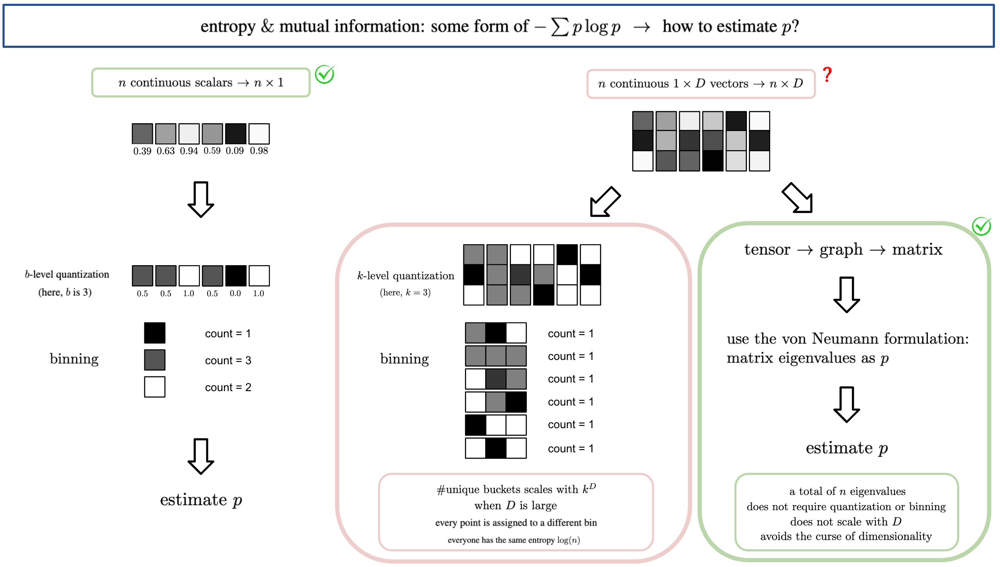
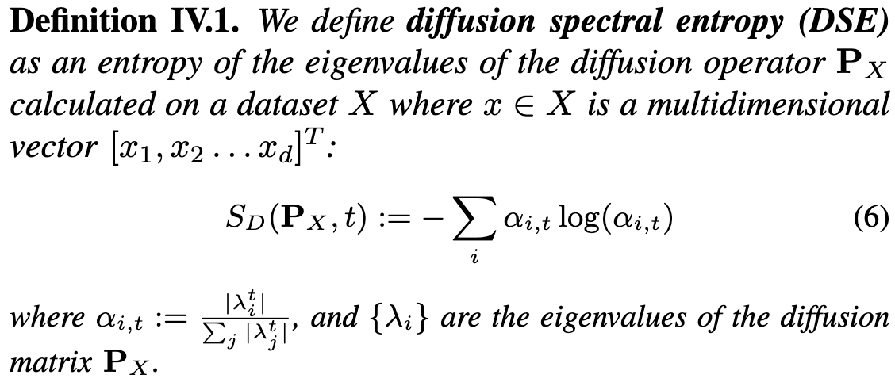
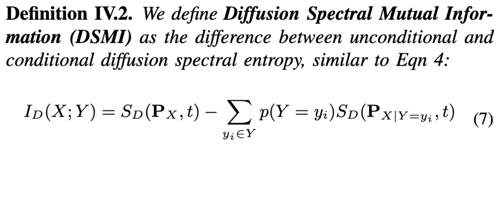
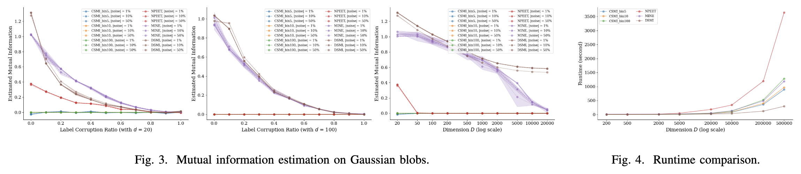
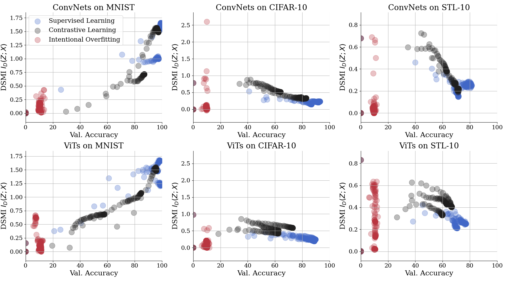
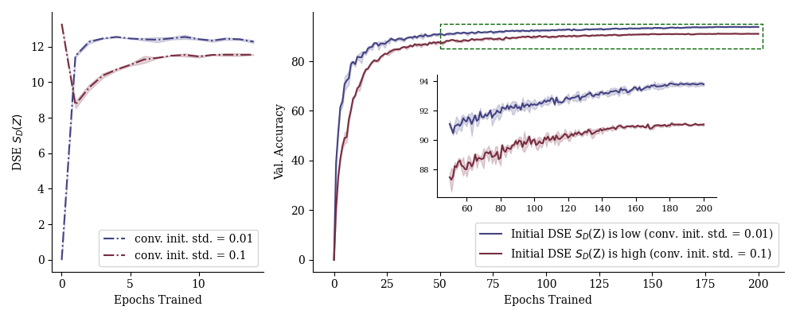
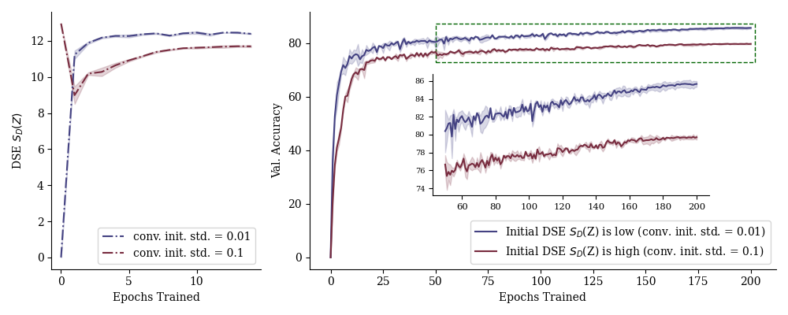
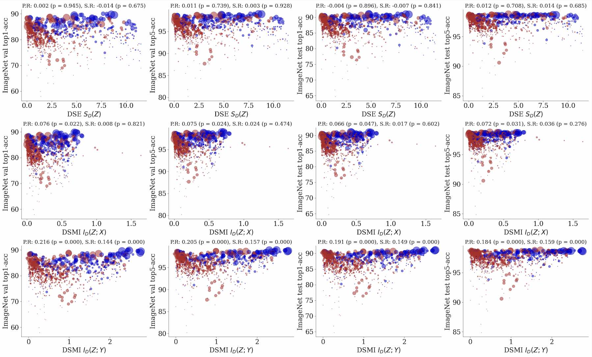

<h1 align="center">
[ICMLW 2023, IEEE CISS 2024] DSE/DSMI
</h1>

<p align="center">
<strong>Diffusion Spectral Entropy and Mutual Information</strong>
</p>

<div align="center">

[](https://arxiv.org/abs/2312.04823)
[](https://chenliu-1996.github.io/slides/DSE_slides.pdf)
[](https://pypi.org/project/dse-dsmi/)
[](https://pepy.tech/projects/dse-dsmi)
[](https://pypistats.org/packages/dse-dsmi)
<br>

[](https://twitter.com/KrishnaswamyLab)
[](https://x.com/DanqiLiao73090)
[](https://twitter.com/ChenLiu_1996)
[](https://www.linkedin.com/in/chenliu1996/)
[](https://github.com/ChenLiu-1996/DiffusionSpectralEntropy/)

</div>


**Krishnaswamy Lab, Yale University**

This is the **official** implementation of

[**Assessing Neural Network Representations During Training Using Noise-Resilient Diffusion Spectral Entropy**](https://arxiv.org/abs/2312.04823)

 &emsp;  &emsp; 


## Announcement
**Due to certain internal policies, we removed the codebase from public access. However, for the benefit of future researchers, we hereby provide the DSE/DSMI functions.**

## Citation
```
@inproceedings{DSE2023,
  title={Assessing Neural Network Representations During Training Using Noise-Resilient Diffusion Spectral Entropy},
  author={Liao, Danqi and Liu, Chen and Christensen, Ben and Tong, Alexander and Huguet, Guillaume and Wolf, Guy and Nickel, Maximilian and Adelstein, Ian and Krishnaswamy, Smita},
  booktitle={ICML 2023 Workshop on Topology, Algebra and Geometry in Machine Learning (TAG-ML)},
  year={2023},
}
@inproceedings{DSE2024,
  title={Assessing neural network representations during training using noise-resilient diffusion spectral entropy},
  author={Liao, Danqi and Liu, Chen and Christensen, Benjamin W and Tong, Alexander and Huguet, Guillaume and Wolf, Guy and Nickel, Maximilian and Adelstein, Ian and Krishnaswamy, Smita},
  booktitle={2024 58th Annual Conference on Information Sciences and Systems (CISS)},
  pages={1--6},
  year={2024},
  organization={IEEE}
}
```

## Quick user guide.

1. Install this tool by running the following line in your conda-accessible command line.

    ```bash
    pip install dse-dsmi --upgrade
    ```

2. You can now import it to a Python script.

    ```python3
    from dse_dsmi import diffusion_spectral_entropy, diffusion_spectral_mutual_information
    ```

3. Simple test scripts.

    <details>
    <summary>Test script on DSE</summary>

        ```python3
        import os
        import numpy as np
        from dse_dsmi import diffusion_spectral_entropy, adjacency_spectral_entropy


        if __name__ == '__main__':
            print('Testing Diffusion Spectral Entropy.')
            print('\n1st run, random vecs, without saving eigvals.')
            embedding_vectors = np.random.uniform(0, 1, (1000, 256))
            DSE = diffusion_spectral_entropy(embedding_vectors=embedding_vectors)
            print('DSE =', DSE)

            print(
                '\n2nd run, random vecs, saving eigvals (np.float16). May be slightly off due to float16 saving.'
            )
            tmp_path = './test_dse_eigval.npz'
            embedding_vectors = np.random.uniform(0, 1, (1000, 256))
            DSE = diffusion_spectral_entropy(embedding_vectors=embedding_vectors,
                                            eigval_save_path=tmp_path)
            print('DSE =', DSE)

            print(
                '\n3rd run, loading eigvals from 2nd run. May be slightly off due to float16 saving.'
            )
            embedding_vectors = None  # does not matter, will be ignored anyways
            DSE = diffusion_spectral_entropy(embedding_vectors=embedding_vectors,
                                            eigval_save_path=tmp_path)
            print('DSE =', DSE)
            os.remove(tmp_path)

            print('\n4th run, random vecs, saving eigvals (np.float64).')
            embedding_vectors = np.random.uniform(0, 1, (1000, 256))
            DSE = diffusion_spectral_entropy(embedding_vectors=embedding_vectors,
                                            eigval_save_path=tmp_path,
                                            eigval_save_precision=np.float64)
            print('DSE =', DSE)

            print('\n5th run, loading eigvals from 4th run. Shall be identical.')
            embedding_vectors = None  # does not matter, will be ignored anyways
            DSE = diffusion_spectral_entropy(embedding_vectors=embedding_vectors,
                                            eigval_save_path=tmp_path)
            print('DSE =', DSE)
            os.remove(tmp_path)

            print('\n6th run, Classic Shannon Entropy.')
            embedding_vectors = np.random.uniform(0, 1, (1000, 256))
            CSE = diffusion_spectral_entropy(embedding_vectors=embedding_vectors,
                                            classic_shannon_entropy=True)
            print('CSE =', CSE)

            print(
                '\n7th run, Entropy on diffusion matrix entries rather than eigenvalues.'
            )
            embedding_vectors = np.random.uniform(0, 1, (1000, 256))
            DSE_matrix_entry = diffusion_spectral_entropy(
                embedding_vectors=embedding_vectors, matrix_entry_entropy=True)
            print('DSE-matrix-entry =', DSE_matrix_entry)

            print(
                '\n8th run, Entropy on KNN binarized adjacency matrix.'
            )
            embedding_vectors = np.random.uniform(0, 1, (1000, 256))
            knn_binarized_entropy = adjacency_spectral_entropy(
                embedding_vectors=embedding_vectors, use_knn=True, knn=10, verbose=True)
            print('KNN binarized adjacency matrix =', knn_binarized_entropy)

            print(
                '\n9th run, Entropy on Gaussian adjacency matrix.'
            )
            embedding_vectors = np.random.uniform(0, 1, (1000, 256))
            gaussian_adj_entropy = adjacency_spectral_entropy(
                embedding_vectors=embedding_vectors, anisotropic=False, verbose=True)
            print('KNN binarized adjacency matrix =', gaussian_adj_entropy)

            print(
                '\n10th run, Entropy on Anisotropic Gaussian adjacency matrix.'
            )
            embedding_vectors = np.random.uniform(0, 1, (1000, 256))
            aniso_adj_entropy = adjacency_spectral_entropy(
                embedding_vectors=embedding_vectors, anisotropic=True, verbose=True)
            print('KNN binarized adjacency matrix =', aniso_adj_entropy)
        ```

    </details>

    <details>
    <summary>Test script on DSE</summary>

        ```python3
        import numpy as np
        from dse_dsmi import diffusion_spectral_mutual_information, adjacency_spectral_mutual_information


        if __name__ == '__main__':
            print('Testing Diffusion Spectral Mutual Information.')
            print('\n1st run. DSMI, Embeddings vs discrete class labels.')
            embedding_vectors = np.random.uniform(0, 1, (1000, 256))
            class_labels = np.uint8(np.random.uniform(0, 11, (1000, 1)))
            DSMI, _ = diffusion_spectral_mutual_information(
                embedding_vectors=embedding_vectors, reference_vectors=class_labels)
            print('DSMI =', DSMI)

            print('\n2nd run. DSMI, Embeddings vs continuous scalars')
            embedding_vectors = np.random.uniform(0, 1, (1000, 256))
            continuous_scalars = np.random.uniform(-1, 1, (1000, 1))
            DSMI, _ = diffusion_spectral_mutual_information(
                embedding_vectors=embedding_vectors,
                reference_vectors=continuous_scalars)
            print('DSMI =', DSMI)

            print('\n3rd run. DSMI, Embeddings vs Input Image')
            embedding_vectors = np.random.uniform(0, 1, (1000, 256))
            input_image = np.random.uniform(-1, 1, (1000, 3, 32, 32))
            input_image = input_image.reshape(input_image.shape[0], -1)
            DSMI, _ = diffusion_spectral_mutual_information(
                embedding_vectors=embedding_vectors, reference_vectors=input_image)
            print('DSMI =', DSMI)

            print('\n4th run. DSMI, Classification dataset.')
            from sklearn.datasets import make_classification
            embedding_vectors, class_labels = make_classification(n_samples=1000,
                                                                n_features=5)
            DSMI, _ = diffusion_spectral_mutual_information(
                embedding_vectors=embedding_vectors, reference_vectors=class_labels)
            print('DSMI =', DSMI)

            print('\n5th run. CSMI, Classification dataset.')
            embedding_vectors, class_labels = make_classification(n_samples=1000,
                                                                n_features=5)
            CSMI, _ = diffusion_spectral_mutual_information(
                embedding_vectors=embedding_vectors,
                reference_vectors=class_labels,
                classic_shannon_entropy=True)
            print('CSMI =', CSMI)

            print('\n6th run. DSMI-matrix-entry, Classification dataset.')
            embedding_vectors, class_labels = make_classification(n_samples=1000,
                                                                n_features=5)
            DSMI_matrix_entry, _ = diffusion_spectral_mutual_information(
                embedding_vectors=embedding_vectors,
                reference_vectors=class_labels,
                matrix_entry_entropy=True)
            print('DSMI-matrix-entry =', DSMI_matrix_entry)

            print('\n7th run. ASMI-KNN, Classification dataset.')
            embedding_vectors, class_labels = make_classification(n_samples=1000,
                                                                n_features=5)
            ASMI_knn, _ = adjacency_spectral_mutual_information(
                embedding_vectors=embedding_vectors,
                reference_vectors=class_labels,
                use_knn=True)
            print('ASMI-KNN =', ASMI_knn)

            print('\n7th run. ASMI-Gaussian, Classification dataset.')
            embedding_vectors, class_labels = make_classification(n_samples=1000,
                                                                n_features=5)
            ASMI_gausadj, _ = adjacency_spectral_mutual_information(
                embedding_vectors=embedding_vectors,
                reference_vectors=class_labels)
            print('ASMI-Gaussian-Adj =', ASMI_gausadj)

            print('\n8th run. ASMI-Gaussian-Anisotropic, Classification dataset.')
            embedding_vectors, class_labels = make_classification(n_samples=1000,
                                                                n_features=5)
            ASMI_anisotropic, _ = adjacency_spectral_mutual_information(
                embedding_vectors=embedding_vectors,
                reference_vectors=class_labels,
                anisotropic=True)
            print('ASMI-Anisotropic-Adj =', ASMI_anisotropic)
        ```

    </details>


## `DSE`: Your APIs (if you are cloning and developing on this repository).
Here we present the refactored and reorganized APIs for this project.

### Diffusion Spectral Entropy
[Go to function](./dse/dse.py/#L10)
```
dse > dse.py > diffusion_spectral_entropy
```

### Diffusion Spectral Mutual Information
[Go to function](./dse/dsmi.py/#L8)
```
dse > dsmi.py > diffusion_spectral_mutual_information
```

### Unit Tests for DSE and DSMI
You can directly run the following lines for built-in unit tests.
```
python dse.py
python dsmi.py
```

## Overview
> We proposed a framework to measure the **entropy** and **mutual information** in high dimensional data and thus applicable to modern neural networks.

We can measure, with respect to a given set of data samples, (1) the entropy of the neural representation at a specific layer and (2) the mutual information between a random variable (e.g., model input or output) and the neural representation at a specific layer.

Compared to the classic Shannon formulation using the binning method, e.g. as in the famous paper **_Deep Learning and the Information Bottleneck Principle_** [[PDF]](https://arxiv.org/abs/1503.02406) [[Github1]](https://github.com/stevenliuyi/information-bottleneck) [[Github2]](https://github.com/artemyk/ibsgd), our proposed method is more robust and expressive.

## Main Advantage
No binning and hence **no curse of dimensionality**. Therefore, **it works on modern deep neural networks** (e.g., ResNet-50), not just on toy models with double digit layer width. See "Limitations of the Classic Shannon Entropy and Mutual Information" in our paper for details.



## A One-Minute Explanation of the Methods
Conceptually, we build a data graph from the neural network representations of all data points in a dataset, and compute the diffusion matrix of the data graph. This matrix is a condensed representation of the diffusion geometry of the neural representation manifold. Our proposed **Diffusion Spectral Entropy (DSE)** and **Diffusion Spectral Mutual Information (DSMI)** can be computed from this diffusion matrix.


## Quick Flavors of the Results

### Definition
 

### Theoretical Results
One major statement to make is that the proposed DSE and DSMI are "not conceptually the same as" the classic Shannon counterparts. They are defined differently and while they maintain the gist of "entropy" and "mutual information" measures, they have their own unique properties. For example, DSE is *more sensitive to the underlying dimension and structures (e.g., number of branches or clusters) than to the spread or noise in the data itself, which is contracted to the manifold by raising the diffusion operator to the power of $t$*.

In the theoretical results, we upper- and lower-bounded the proposed DSE and DSMI. More interestingly, we showed that if a data distribution originates as a single Gaussian blob but later evolves into $k$ distinct Gaussian blobs, the upper bound of the expected DSE will increase. This has implication for the training process of classification networks.

### Empirical Results
We first use toy experiments to showcase that DSE and DSMI "behave properly" as measures of entropy and mutual information. We also demonstrate they are more robust to high dimensions than the classic counterparts.

Then, we also look at how well DSE and DSMI behave at higher dimensions. In the figure below, we show how DSMI outperforms other mutual information estimators when the dimension is high. Besides, the runtime comparison shows DSMI scales better with respect to dimension.



</br>

Finally, it's time to put them in practice! We use DSE and DSMI to visualize the training dynamics of classification networks of 6 backbones (3 ConvNets and 3 Transformers) under 3 training conditions and 3 random seeds. We are evaluating the penultimate layer of the neural network --- the second-to-last layer where people believe embeds the rich representation of the data and are often used for visualization, linear-probing evaluation, etc.


DSE(Z) increasese during training. This happens for both generalizable training and overfitting. The former case coincides with our theoretical finding that DSE(Z) shall increase as the model learns to separate data representation into clusters.


DSMI(Z; Y) increases during generalizable training but stays stagnant during overfitting. This is very much expected.



DSMI(Z; X) shows quite intriguing trends. On MNIST, it keeps increasing. On CIFAR-10 and STL-10, it peaks quickly and gradually decreases. Recall that IB [Tishby et al.] suggests that I(Z; X) shall decrease while [Saxe et al. ICLR'18] believes the opposite. We find that both of them could be correct since the trend we observe is dataset-dependent. One possibility is that MNIST features are too easy to learn (and perhaps the models all overfit?) --- and we leave this to future explorations.


## Utility Studies: How can we use DSE and DSMI?
One may ask, besides just peeking into the training dynamics of neural networks, how can we _REALLY_ use DSE and DSMI? Here comes the utility studies.

### Guiding network initialization with DSE
We sought to assess the effects of network initialization in terms of DSE. We were motivated by two observations: (1) the initial DSEs for different models are not always the same despite using the same method for random initialization; (2) if DSE starts low, it grows monotonically; if DSE starts high, it first decreases and then increases.

We found that if we initialize the convolutional layers with weights $\sim \mathcal{N}(0, \sigma)$, DSE $S_D(Z)$ is affected by $\sigma$. We then trained ResNet models with networks initialized at high ($\approx$ log(n)) versus low ($\approx 0$) DSE by setting $\sigma=0.1$ and $\sigma=0.01$, respectively. The training history suggests that initializing the network at a lower $S_D(Z)$ can improve the convergence speed and final performance. We believe this is because the high initial DSE from random initialization corresponds to an undesirable high-entropy state, which the network needs to get away from (causing the DSE decrease) before it migrates to the desirable high-entropy state (causing the DSE increase).

 

### ImageNet cross-model correlation
By far, we have monitored DSE and DSMI **along the training process of the same model**. Now we will show how DSMI correlates with downstream classification accuracy **across many different pre-trained models**. The following result demonstrates the potential in using DSMI for pre-screening potentially competent models for your specialized dataset.




## Reproducing Results in the ongoing submission.
Removed due to internal policies.

## Preparation

### Environment
We developed the codebase in a miniconda environment.
Tested on Python 3.9.13 + PyTorch 1.12.1.
How we created the conda environment:
**Some packages may no longer be required.**
```
conda create --name dse pytorch==1.12.1 torchvision==0.13.1 torchaudio==0.12.1 cudatoolkit=11.3 -c pytorch
conda activate dse
conda install -c anaconda scikit-image pillow matplotlib seaborn tqdm
python -m pip install -U giotto-tda
python -m pip install POT torch-optimizer
python -m pip install tinyimagenet
python -m pip install natsort
python -m pip install phate
python -m pip install DiffusionEMD
python -m pip install magic-impute
python -m pip install timm
python -m pip install pytorch-lightning
```


